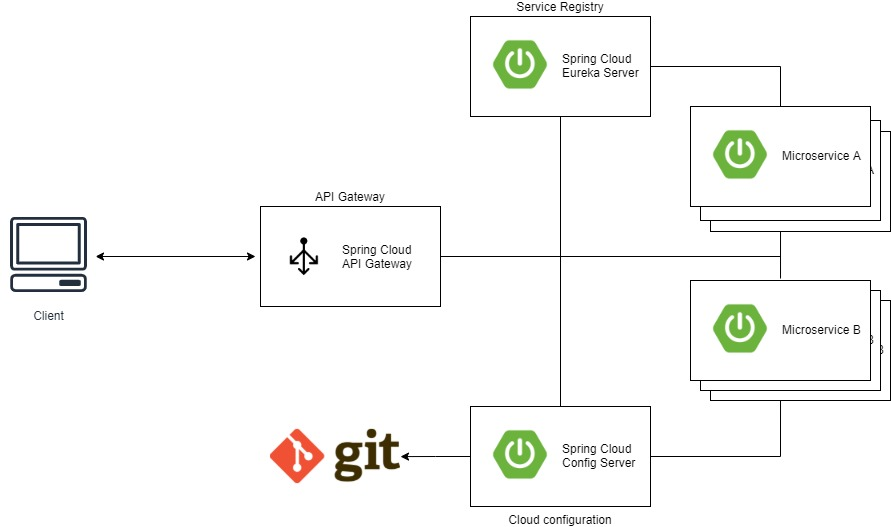

# spring-cloud-practice

### 스프링 클라우드를 활용한 MSA 프로젝트 제작을 연습하기 위한 데모

## 프로젝트 구조

여기서 클라이언트는 API를 사용할 수 있는 모든 사용자가 될 수 있겠다.

## 각 모듈에 대한 설명

### 1. Service Discovery
마이크로서비스를 찾을 수 있게 서비스 라우팅 정보를 가지고 있는 레지스트리 서버이다. \
MSA에서 분산되어 있는 서비스들은 서로 다른 서비스간의 정확한 위치를 알 수 없기 때문에 \
이 플랫폼내에서 모든 서비스 라우팅 정보를 저장하고 있는 DNS 같은 역할을 담당한다.\
이 모듈은 Spring Eureka Server를 사용한다.

### 2. API Gateway
클라이언트가 이 플랫폼을 통해 사용하고자 하는 서비스를 접근하기 위한 가장 앞단에 존재하는 로드밸런싱 모듈이다. \
\
일반적인 microservice를 API 요청시 입구로 사용할수도 있겠지만, 보통의 서비스들은 Spring MVC 프레임워크를 사용한다. \
그 경우에 요청을 처리할 수 있는 스레드 풀이 정적으로 할당되어 요청 처리시 블로킹이 되어 \
동시간대에 많은 요청수가 몰릴시에 프로세스 자체의 부하가 크지 않더라도 \
모든 스레드들이 블로킹되어 요청의 순차적인 처리를 위해 응답시간이 지연되는 단점이 있다. \
\
API Gateway의 역할은 client의 요청을 하나의 엔드포인트로 단일화하여 서비스를 대신 호출해주는 역할을 하기 때문에, \
인증, 인가 정도를 제외하면 비즈니스 로직을 수행하는 작업이 거의 없다. \
Spring API Gateway를 사용하면 Spring Webflux로 구현되어 있어, non block i/o로 동작하기 때문에 \
뒷단의 microservice instance들이 각자 부하만 감당이 된다면, gateway에서는 더 적은 리소스로 효율적으로 동작할 수 있다.

### 3. Cloud Configuration
이 프로젝트 내에 존재하는 서비스들의 모든 설정 정보를 관리하기 위한 저장소 역할을 한다. \
이렇게 관리하게 되면, 각 서비스들의 설정 정보들을 런타임중 변경사항을 갱신하거나 \
서비스의 각 환경에 따라 app을 쉽게 배포할 수 있게 해준다.

### 4. Microservice
클라이언트가 원하는 요구사항에 대한 서비스를 제공하는 서비스 목록이다.\
마이크로서비스에서의 서비스는 각자의 책임 영역을 가지고 비즈니스 로직을 개발하여 독립적으로 운영, 배포를 할 수 있다.\
\
모놀리틱 아키텍처에서는 각자의 서비스들이 얽혀 있어, 서비스의 규모들이 커질수록 \
특정 비즈니스 로직을 추가/수정시에 부담감이 커질수 밖에 없다. \
\
마이크로서비스는 그에 반해, 서비스들을 잘게 쪼개져 있기 때문에 \
적은 코드 베이스 관리와 쉬운 배포, 장애 격리 같은 장점을 가질 수 있게 된다.\
## ○ 개발 대상 모듈 경로
1. [spring cloud eureka server](https://github.com/bbidag/spring-cloud-eureka-server)
2. [spring cloud api gateway](https://github.com/bbidag/spring-cloud-api-gateway)
3. [spring cloud config server](https://github.com/bbidag/spring-cloud-config-server)
4. spring cloud microservice
    - 그냥 A, B 같이 하면 재미없으니 고객 서비스, 물류 관리 서비스 라는 가상의 서비스를 만들었다.
    - [microservice-customer](https://github.com/bbidag/spring-cloud-microservice-customer)
    - [microservice-scm](https://github.com/bbidag/spring-cloud-microservice-scm)
